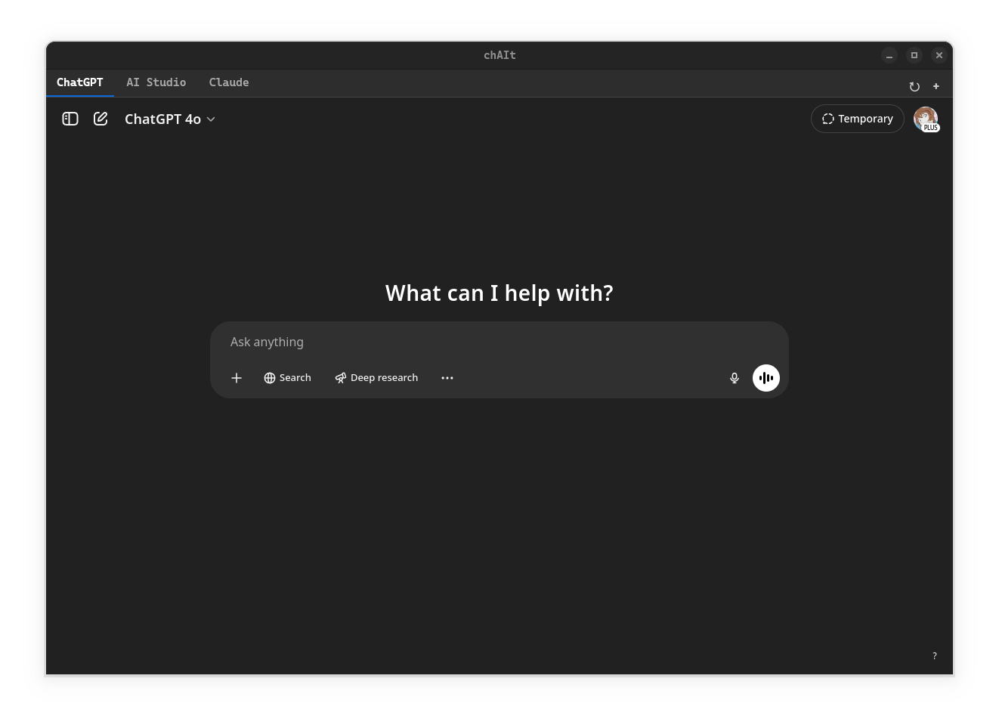

# chAIt

A vibe coded simple ai chat wrapper using qt6 (primarily built for personal use)



## Run Development

1. Install dependencies:

   ```bash
   pip install -r requirements.txt
   ```

2. Run the application:

   ```bash
   make run # or: python -m chait
   ```

## Installation (System-Wide Linux using Make)

1. **Prerequisites:** Ensure `make`, `python3`, `pip`, and `sudo` privileges are available. Also ensure `chait/assets/icon.png` and `chait/styles/style.css` exist. The installation uses standard Fedora paths and commands. Cache updates require `desktop-file-utils` and `gtk3` (or `gtk4`), which are typically pre-installed on Fedora Workstation.

2. **Install:** Navigate to the `chAIt` directory in your terminal and run:

   ```bash
   make install
   ```

3. **Run:** You should now find "chAIt" in your application menu, or you can run `chait` from the terminal.

## Uninstallation

1 Navigate to the `chAIt` directory in your terminal and run:

```bash
make uninstall
```

## Cleaning Build Files

To remove temporary build files created during installation:

```bash
make clean
```
